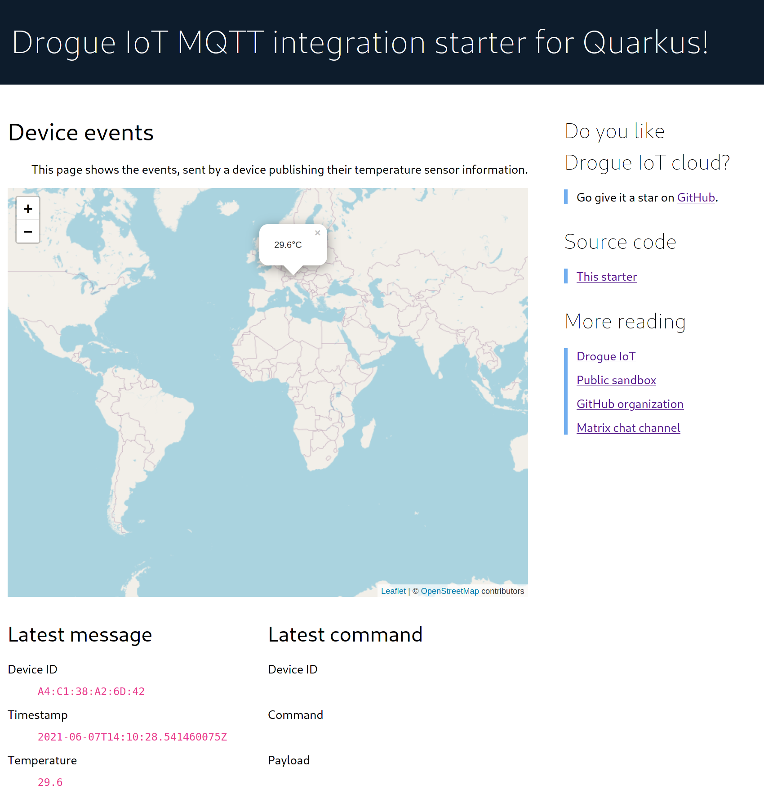

# Drogue IoT: Quarkus MQTT integration starter

This is an example of using the MQTT integration of [Drogue IoT](https://drogue.io) in combination
with [Quarkus](https://quarkus.io/).

## What does it do?

It is a small Quarkus application, which connects to the MQTT integration endpoint of Drogue IoT. Receiving messages
from devices publishing to Drogue IoT Cloud.

## How can you run it?

This is a standard Quarkus application, you can run it in any way you would run a normal Quarkus/Java application.

In the following sub-sections give you some help, with some common examples.

### Locally

Simply run it using:

    mvn quarkus:dev

### Deploy using YAML

The repository has a [`deploy/`](/deploy) folder, which contains deployment scripts for Kubernetes.

All you need to do is to deploy the YAML file:

    kubectl apply -f deploy/

### Deploy using Helm

You can also deploy this using the Quarkus Helm charts. This will set up a build on the Cluster too.

    helm install --repo https://redhat-developer.github.io/redhat-helm-charts \
        my-drogue-quarkus-mqtt-integration quarkus \
        --set build.uri=https://github.com/drogue-iot/quarkus-mqtt-integration-starter

Also see: https://github.com/redhat-developer/redhat-helm-charts/tree/master/alpha/quarkus-chart

## What can I expect?

Once it is running, you can navigate to its web frontend and should see something like this:

### What does it show?

The dashboard will show the most recent state information. If the temperature information did have geo-coordinates
attached, it will drop a marker on the map with the measured temperature. Only the most recent value will be shown.

### Where does the data come from?

The data comes from a public instance of Drogue IoT. The Quarkus backend subscribes to the data stream using MQTT and
consumes all incoming data.

## What is next?

You can clone this repository, and start making modifcations to the example. Either running it locally, or deploying it
on your own cluster.
